## Hello There :v: 
I'm Alex, a **computer science student** at the Karlsruher Institut of Technology.

I mostly do front-end development, but I also take part in Game Jams like Ludum Dare and code applications too. In the past I also took part in Robot Competitions like FLL and WRO.

---
### Tools

---
### Projects

---

<!--

